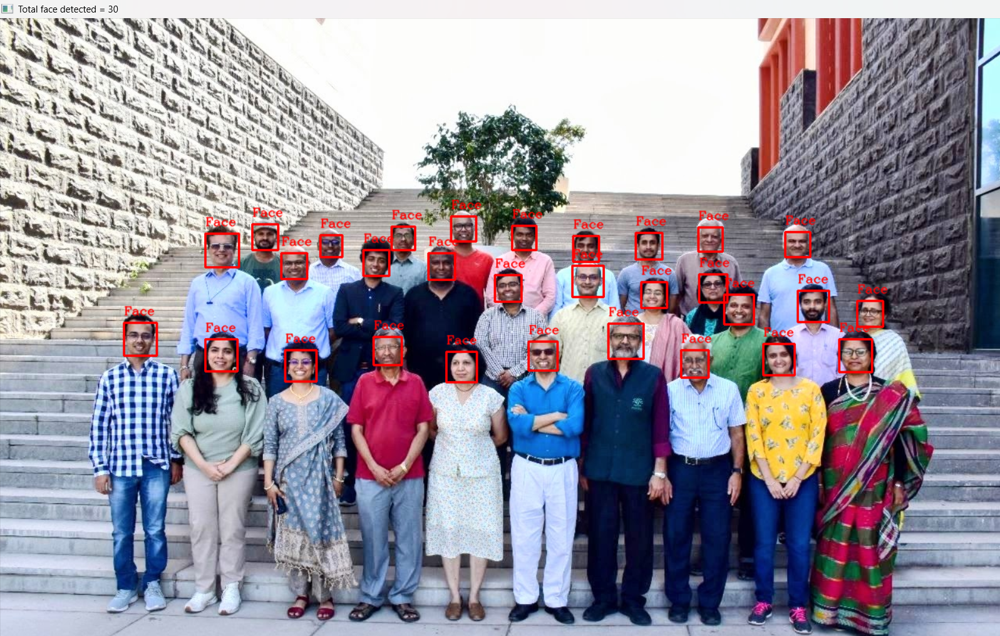
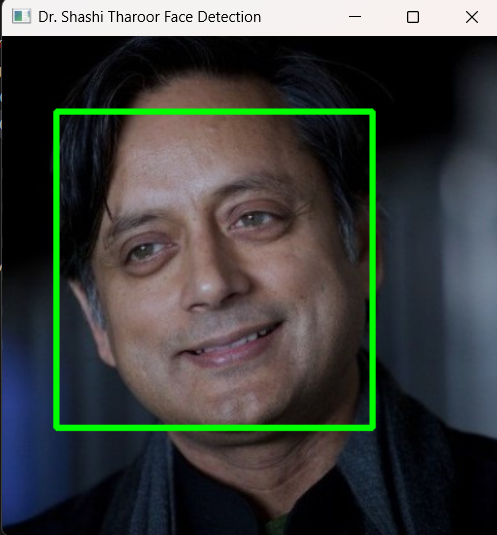
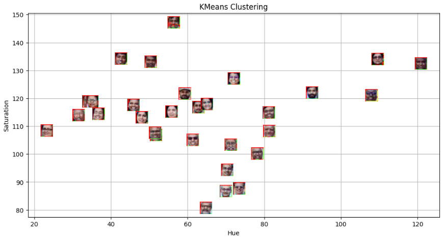
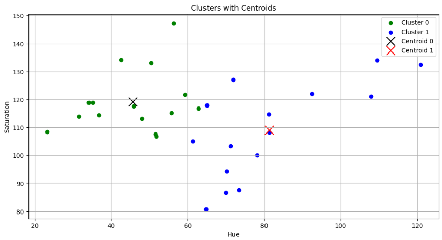
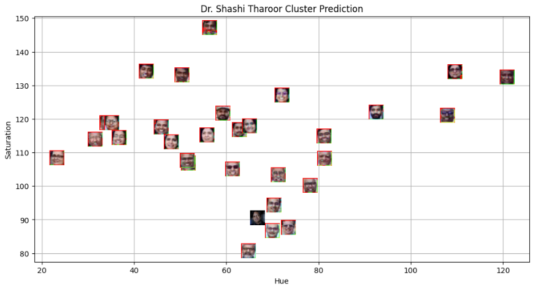
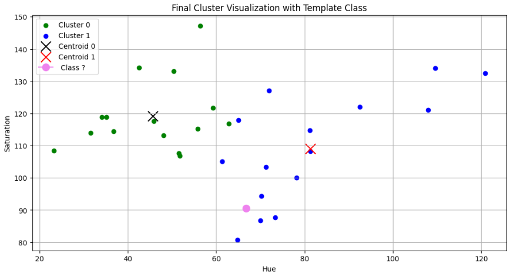

# 📊 K-Means Clustering – Lab 5 (Spring 2026)

This project demonstrates the implementation and visualization of **K-Means Clustering** using Python.  
It includes step-by-step clustering results, centroid visualization, and final predictions.

---

## 🚀 Project Overview

K-Means is an unsupervised machine learning algorithm used to group data into **K distinct clusters** based on similarity.

In this lab:

- Data is visualized before clustering
- K-Means algorithm is applied
- Cluster centroids are computed
- Final cluster predictions are visualized
- Results are analyzed and interpreted

---

## 📷 Visual Outputs

### 1️⃣ Initial Data Visualization

---

### 2️⃣ Additional Data View

---

### 3️⃣ K-Means Clustering Result

---

### 4️⃣ Clusters with Centroids

---

### 5️⃣ Cluster Predictions

---

### 6️⃣ Final Cluster Prediction

---

## 🧠 Algorithm Used

### K-Means Clustering

Steps followed:

1. Choose number of clusters (K)
2. Initialize centroids randomly
3. Assign each data point to nearest centroid
4. Recalculate centroids
5. Repeat until convergence

---

## 🛠️ Technologies Used

- Python
- NumPy
- Matplotlib
- Scikit-learn
- Jupyter Notebook

---

## 📈 Learning Outcomes

- Understanding unsupervised learning
- Implementing K-Means algorithm
- Visualizing clusters and centroids
- Interpreting clustering results

